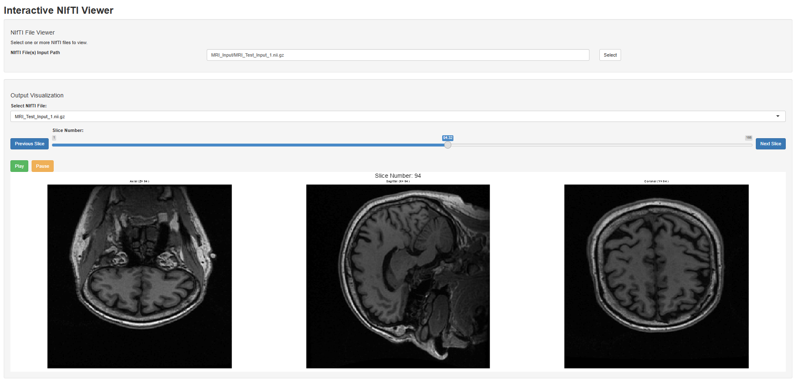

# Interactive NIfTI Viewer
A Shiny app for viewing NIfTI (.nii, .nii.gz) neuroimaging files with axial, sagittal, and coronal views.

## Features

- Select one or more NIfTI files to view.
- View axial, sagittal, and coronal slices side by side.
- Navigate through slices using Previous/Next buttons or a slider.
- Play/Pause functionality to automatically scroll through slices.

## Screenshot




## Installation

### Prerequisites

- R (version 3.5 or higher recommended)
- RStudio (optional but recommended)


### Required Packages

Install the required R packages by running:

```R
install.packages(c("shiny", "shinyFiles", "neurobase", "oro.nifti", "fs"))
```

### Usage
- Clone this repository or download the code files.
- Open Interactive_NIfTI_Viewer.R in RStudio or your preferred R environment.
- Run the app by executing:

```R
shiny::runApp('C:\\path_to_file\\Interactive_NIfTI_Viewer.R')
```
